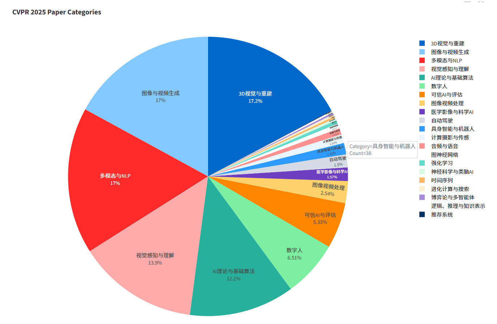
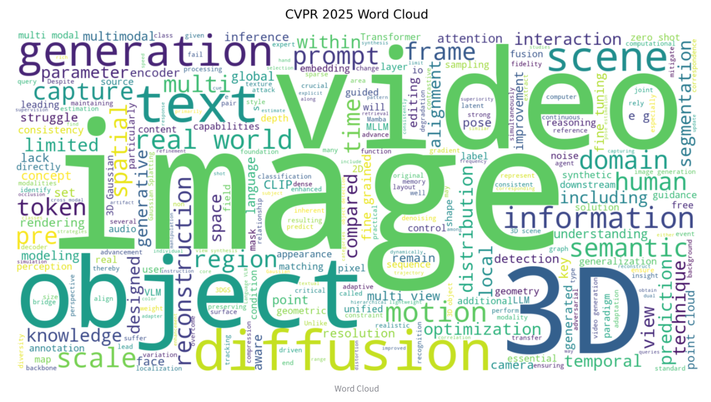
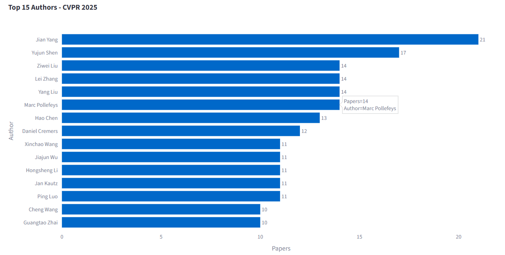

# CV Scraper & Analyzer

这是一个基于 Python 和 Streamlit 的论文爬取与分析工具，旨在帮助研究人员快速从顶级计算机视觉会议中获取论文信息，并进行深度分析与可视化。

## 目录
- [介绍](#介绍)
- [功能](#功能)
- [技术亮点](#技术亮点)
- [环境安装](#环境安装)
- [使用说明](#使用说明)
- [可视化展示](#可视化展示)
- [贡献](#贡献)
- [许可证](#许可证)

## 介绍
本项目目前支持以下CV领域会议：
- **CVPR** 
- **ICCV** 
- **ECCV** 
- **NeurIPS** 

## 功能
-  **多元爬取**：支持从不同年份的会议官网爬取论文标题、摘要、作者、PDF链接等信息。
-  **匹配分类**：基于关键词权重的正则匹配算法，自动归类论文方向。
-  **交互可视化**：
    - 动态论文类别分布图
    - 关键词词云图
    - 高产作者排行榜
-  **Web界面**：基于Streamlit构建前端，支持一键爬取、数据预览、CSV下载及可视化图表交互等功能。
-  **网页搜索**：网页内支持按关键词搜索论文，或按类别筛选特定方向论文。

## 技术亮点
- **OOP设计**：代码结构清晰，易于维护与扩展。
- **并发加速**：利用`ThreadPoolExecutor`实现多线程并行爬取，显著缩短数据获取时间。
- **鲁棒性设计**：引入`requests.Session`复用连接，配合重试机制与指数退避算法，有效处理网络波动造成的Error。
- **分类加速**：使用预编译正则表达式(Regex Pre-compilation)加速分类过程中的大规模文本匹配。
- **数据持久化**：利用Streamlit Session State管理保存状态，确保交互体验流畅。

## 环境安装

1. **克隆项目仓库**
   ```bash
   git clone https://github.com/Wayneee/cv-scraper-analyzer.git
   cd cv-scraper-analyzer
   ```

2. **安装依赖**
   ```bash
   pip install -r requirements.txt
   ```

## 使用说明

### 1. Web 界面运行 (推荐)
通过Streamlit启动可视化界面，体验完整交互功能。

```bash
python -m streamlit run streamlit_app.py --server.headless true --browser.gatherUsageStats false
```

启动后，按照终端输出提示访问地址（本地通常为 `http://localhost:8501`）。

### 2. 命令行运行
仅用于数据爬取和生成静态图片（不支持动态图表交互）。

**注意**：请确保文件名输入正确，项目核心文件为 `paper_scraper_oop.py`。确保满足部分会议年份要求（如ICCV奇数年、ECCV偶数年）。

```bash
python paper_scraper_oop.py -c [会议] -y [年份] -m [模式] -w [线程数]
```

**参数说明**：
- `-c`: 会议名称 (cvpr, iccv, eccv, neurips)
- `-y`: 年份 (例如 2025, 2024)
- `-m`: 模式 (full、analyze、scrape)
- `-w`: 线程数 (建议 10-20)

**示例**：
```bash
python paper_scraper_oop.py -c cvpr -y 2025 -m full -w 20
```

## 可视化展示

| 动态论文分布图 |
| :---: |
|  |

| 词云图 |
| :---: |
|  |

| 动态作者产出统计图 |
| :---: |
|  |

## 贡献
欢迎提交 Issue 或 Pull Request 来改进本项目！

## 许可证
本项目基于 [MIT License](LICENSE) 开源。
